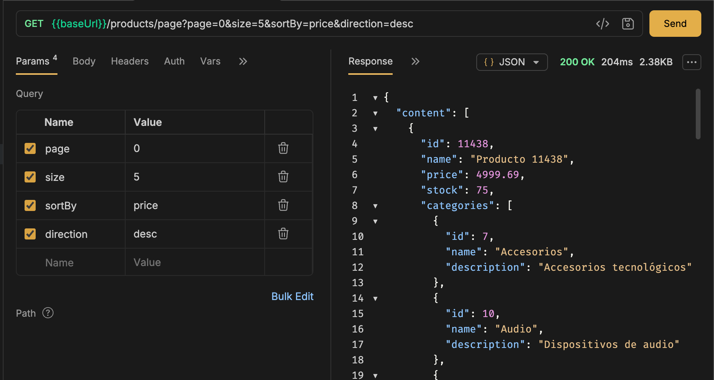
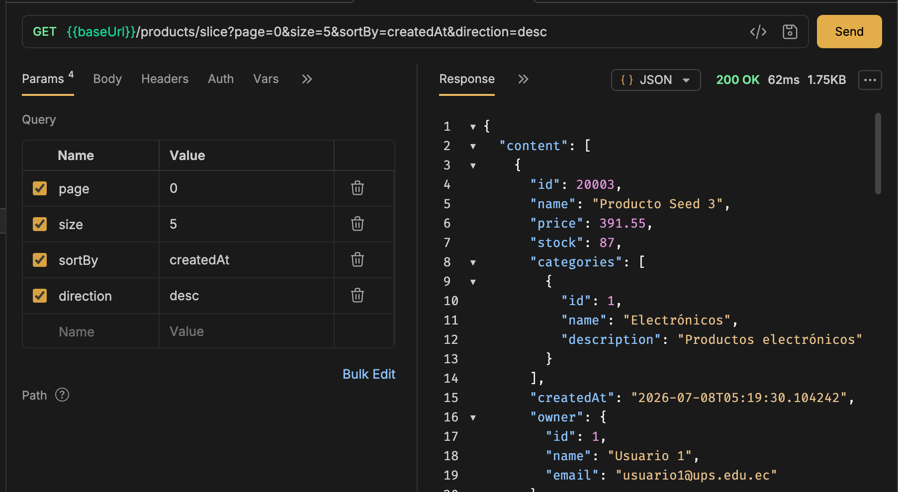
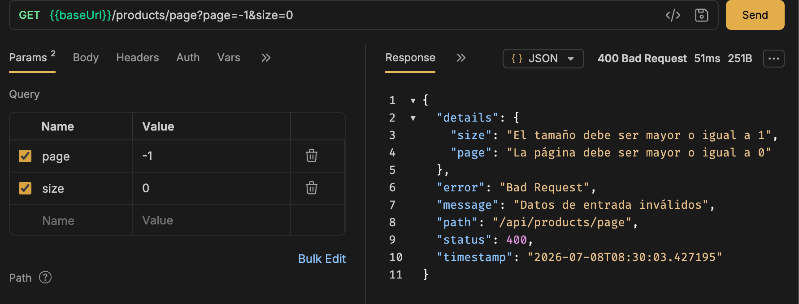
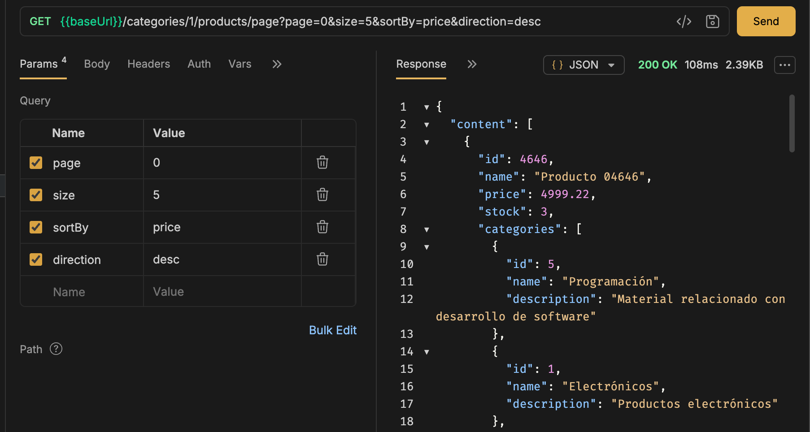
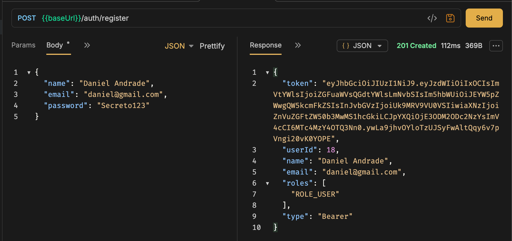
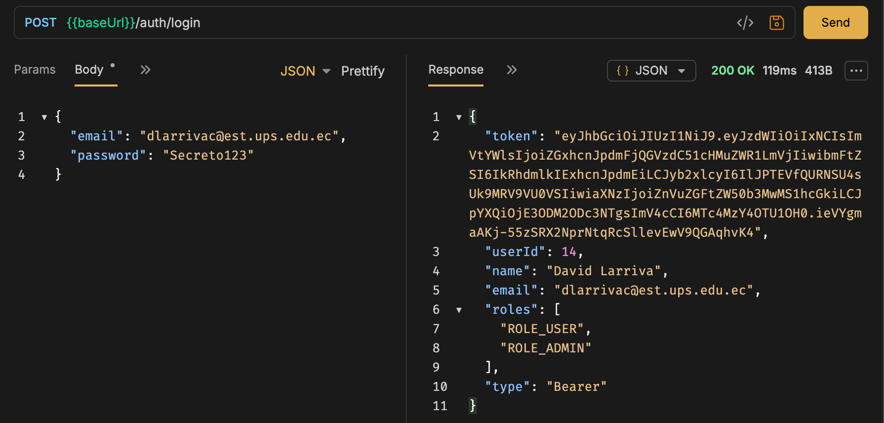
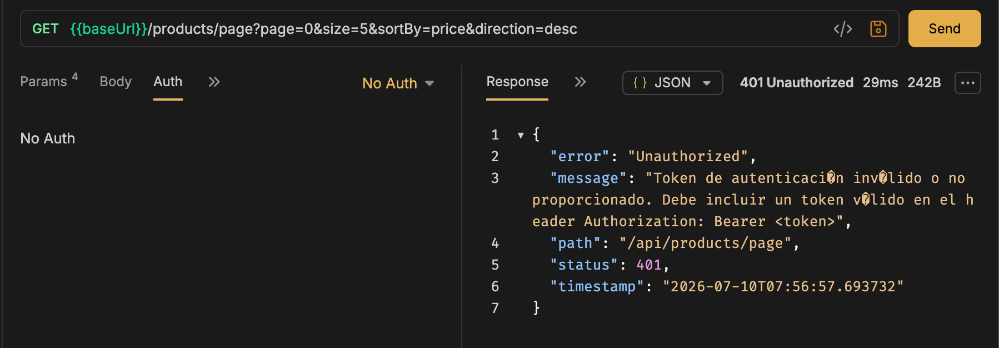
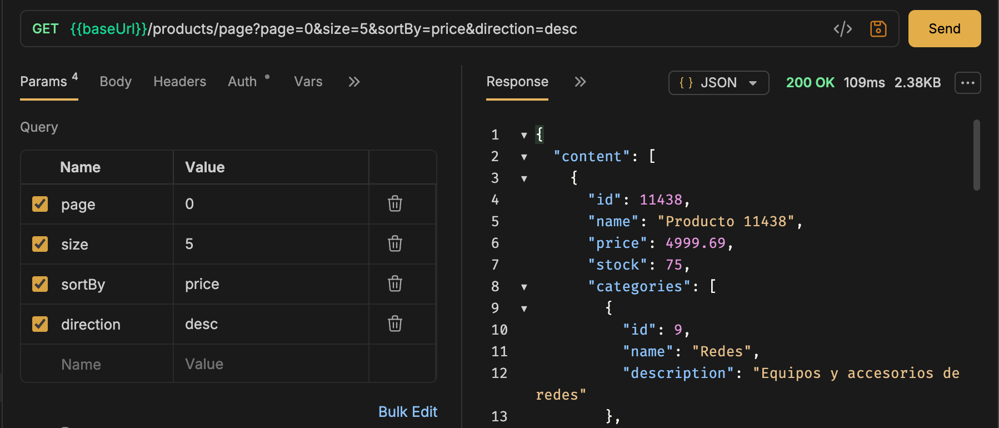
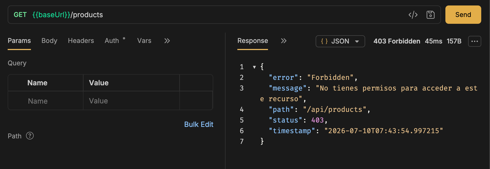
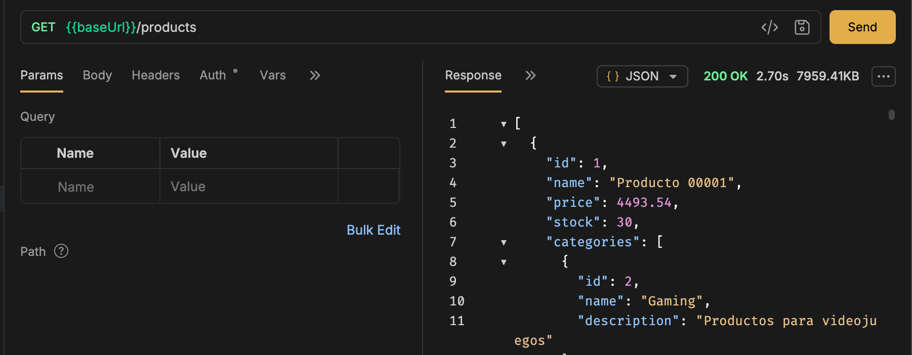

# Prácticas Spring Boot - fundamentos01

Proyecto de la materia Programación y Plataformas Web (UPS). Sobre el mismo proyecto voy
agregando cada práctica.

## Datos del proyecto

- Group: `ec.edu.ups.icc`
- Artifact: `fundamentos01`
- Java 25, Gradle (Groovy), Spring Boot 4.1.0
- Dependencias: Spring Web (`spring-boot-starter-webmvc`) y Spring Boot DevTools

## Cómo correrlo

```bash
./gradlew bootRun
```

Arranca un Tomcat embebido en el puerto 8080. En `application.yml` dejé una ruta base
`/api`, así que todos los endpoints cuelgan de ahí.

---

# Práctica 01 - Configuración

Dejar el entorno listo (Java + Gradle + Spring Boot) y levantar un primer endpoint de
estado.

```
GET http://localhost:8080/api/api/status
```

```json
{
  "service": "Spring Boot API",
  "status": "running",
  "timestamp": "2026-06-19T02:43:22.606358Z"
}
```

> Nota: la ruta queda con `/api` doble porque al `context-path: /api` se le suma el
> `@GetMapping("/api/status")` del controlador.

---

# Práctica 02 - Estructura del proyecto

Organizar el código en paquetes por dominio. Agregué un módulo `students` con su
controlador y su modelo en carpetas separadas.

```
GET http://localhost:8080/api/students          -> lista de estudiantes
GET http://localhost:8080/api/students/count     -> cantidad de estudiantes
```

```json
[
  { "id": 2, "name": "Juan", "age": "30" },
  { "id": 1, "name": "Diego", "age": "10" }
]
```

---

# Práctica 03 - API REST

CRUD REST completo, en memoria (sin servicios ni base de datos todavía), usando DTOs,
modelo y un mapper. Lo hice para `users` y lo repliqué para `products`.

## Endpoints

Mismos 6 métodos para cada recurso (`/users` y `/products`):

| Método | Ruta | Descripción |
|--------|------|-------------|
| GET | `/api/users` | Lista todos |
| GET | `/api/users/{id}` | Uno por id |
| POST | `/api/users` | Crea (id autogenerado) |
| PUT | `/api/users/{id}` | Reemplaza todo |
| PATCH | `/api/users/{id}` | Actualiza solo lo que llega |
| DELETE | `/api/users/{id}` | Elimina |

Para productos es igual cambiando `/users` por `/products`.

## Ejemplos

Crear un usuario:

```
POST /api/users
{ "name": "Ana", "email": "ana@ups.edu.ec", "password": "1234" }
```

```json
{ "id": 1, "name": "Ana", "email": "ana@ups.edu.ec" }
```

La respuesta nunca devuelve `password` ni `passwordHash`. Si el id no existe, responde
`404` con un mensaje:

```json
{ "message": "Usuario no encontrado con id 99" }
```

Un producto tiene `id`, `name`, `price`, `stock`:

```json
{ "id": 1, "name": "Teclado", "price": 25.5, "stock": 10 }
```

## Estructura (por recurso)

```
users/
├── controllers/UserController.java   Los 6 endpoints
├── dtos/                             CreateUserDto, UpdateUserDto, PartialUpdateUserDto, UserResponseDto
├── models/UserModel.java             Datos internos del usuario
└── mappers/UserMapper.java           DTO <-> modelo (genera passwordHash y createdAt)
```

`products/` tiene la misma estructura.

## Lo que entendí

Cada recurso separa lo que entra (los DTOs `Create`/`Update`/`PartialUpdate`) de lo que
sale (`ResponseDto`), y el modelo interno queda escondido. El mapper es el que traduce
entre ellos, así no expongo datos sensibles como la contraseña.

El controlador guarda los registros en una lista en memoria y genera los ids con un
contador. Con `ResponseEntity` controlo el código HTTP: `201` al crear, `200` al
consultar o actualizar, `204` al eliminar y `404` cuando el id no existe. La diferencia
entre `PUT` y `PATCH` es que PUT reemplaza todos los campos y PATCH solo cambia los que
llegan con valor.

---

# Práctica 04 - Controladores y servicios

Saqué la lógica de los controladores y la moví a una capa de **servicios**. Ahora el
controlador solo recibe la petición y se la pasa al servicio; el servicio es el que hace
el trabajo (buscar, crear, actualizar, borrar) sobre la lista en memoria.

## Cómo se conecta

- El servicio se marca con `@Service` para que Spring lo cree y lo administre.
- El controlador lo recibe por el **constructor** (inyección de dependencias): no hace
  `new` del servicio, lo pone Spring solo.

```java
@RestController
@RequestMapping("/users")
public class UserController {
    private final UserService userService;            // la interfaz

    public UserController(UserService userService) {  // Spring inyecta UserServiceImpl
        this.userService = userService;
    }

    @GetMapping
    public List<UserResponseDto> findAll() {
        return userService.findAll();                 // solo delega
    }
}
```

## Estructura nueva (por recurso)

```
users/
├── controllers/UserController.java   Solo recibe y delega
├── services/
│   ├── UserService.java              Interfaz: qué se puede hacer
│   └── UserServiceImpl.java          @Service: la lógica + la lista en memoria
├── dtos/  models/  mappers/          igual que antes
```

`products/` se replicó igual (`ProductService` + `ProductServiceImpl`).

Los endpoints son los mismos de la Práctica 03; la diferencia es interna. Cuando algo no
se encuentra, el servicio devuelve un `ErrorResponseDto` con un mensaje (los códigos HTTP
correctos llegan en la Práctica 07).

## Lo que entendí

El **servicio** es la clase que hace el trabajo de verdad; el **controlador** es solo la
puerta de entrada. Separarlos (cada uno con una sola responsabilidad) deja el código más
ordenado y listo para cuando se conecte una base de datos. La **inyección de
dependencias** es que yo solo pido `UserService` en el constructor y Spring me entrega la
implementación (`UserServiceImpl`, la marcada con `@Service`) sin que yo la cree a mano.

---

# Práctica 05 - Persistencia con PostgreSQL y JPA

Reemplacé la lista en memoria de `users` por una base de datos real: PostgreSQL corriendo
en Docker, conectado con Spring Data JPA + Hibernate.

## Cómo se conecta

- Levanté un contenedor `postgres-dev` con Docker (PostgreSQL 16) y una base `devdb`.
- En `application.yml` agregué los datos de conexión (`url`, `username`, `password`) y
  `ddl-auto: update`, para que Hibernate cree/actualice las tablas solo.
- Agregué las dependencias `spring-boot-starter-data-jpa` y el driver `postgresql`.

## Piezas nuevas (por recurso)

```
core/
└── entities/BaseEntity.java          id, createdAt, updatedAt, deleted (compartido)

users/
├── entities/UserEntity.java          @Entity, mapea la tabla "users"
└── repositories/UserRepository.java  extiende JpaRepository<UserEntity, Long>
```

`UserMapper` ahora también convierte `Model <-> Entity`, además de `Dto <-> Model` que ya
tenía.

## Cómo cambió el servicio

`UserServiceImpl` ya no tiene una `List<UserModel>`: usa `UserRepository`, que Spring
inyecta por el constructor igual que el servicio en la Práctica 04.

```java
private final UserRepository userRepository;

public UserServiceImpl(UserRepository userRepository) {
    this.userRepository = userRepository;
}
```

Cada método llama a `userRepository` (`save`, `findById`, `findAll`) en vez de manipular
una lista. Si no existe el id, lanza un error simple (`IllegalStateException`); el manejo
de errores prolijo llega en una práctica posterior. El `delete` ya no borra la fila: solo
marca `deleted = true` (borrado lógico).

## Probando que persiste de verdad

```bash
docker exec -it postgres-dev psql -U ups -d devdb -c "SELECT * FROM users;"
```

Si reinicio la aplicación, los usuarios siguen ahí (antes, con la lista en memoria, se
perdían).

## Lo que entendí

El **repositorio** reemplaza por completo la lista en memoria: con `JpaRepository` ya
tengo `save`, `findById`, `findAll`, `delete`, etc. sin escribir SQL. La diferencia entre
**Entity** y **Model** es que la Entity sabe cómo se guarda en la tabla (tiene anotaciones
de JPA) y el Model es solo la representación interna de la aplicación; nunca se debe
exponer la Entity directamente al cliente. `BaseEntity` evita repetir `id`,
`createdAt`, `updatedAt` y `deleted` en cada entidad nueva.

# Práctica 06 - Validación de DTOs

Antes de esta práctica, un `POST /users` con `name` vacío o `email` mal escrito se
guardaba igual en la base de datos. Ahora los DTOs de entrada validan el formato de los
datos antes de que lleguen al servicio.

## Dependencia nueva

Agregué `spring-boot-starter-validation` en `build.gradle` (Jakarta Validation).

## Anotaciones en los DTOs

En `CreateUserDto`, `UpdateUserDto`, `PartialUpdateUserDto` (y sus equivalentes en
`products`) agregué reglas con anotaciones de Jakarta:

```java
@NotBlank(message = "El nombre es obligatorio")
@Size(min = 3, max = 150, message = "El nombre debe tener entre 3 y 150 caracteres")
private String name;

@NotBlank(message = "El email es obligatorio")
@Email(message = "Debe ingresar un email válido")
private String email;
```

En los DTOs de actualización parcial (`PartialUpdateUserDto`, `PartialUpdateProductDto`)
no usé `@NotBlank`/`@NotNull`, porque ahí los campos son opcionales: solo se valida el
formato del campo que sí llega.

En `products` agregué `@Min(0)` para `price` y `stock`, porque no tiene sentido un precio
o stock negativo.

## Activar la validación en el controller

Sin `@Valid`, las anotaciones del DTO no se ejecutan. Hay que agregarlo en cada
`@RequestBody`:

```java
@PostMapping
public UserResponseDto create(@Valid @RequestBody CreateUserDto dto) {
    return userService.create(dto);
}
```

Hice lo mismo en `update` y `partialUpdate`, en `UserController` y en `ProductController`.

## Validación de negocio en el servicio

La validación del DTO solo revisa el formato. Que el email ya esté registrado es una
regla de negocio, así que la agregué en `UserServiceImpl.create`:

```java
if (userRepository.findByEmail(dto.getEmail()).isPresent()) {
    throw new ConflictException("Email already registered");
}
```

Repliqué la misma idea en `products`: agregué `findByName` en `ProductRepository` y
valido que no exista ya un producto activo con ese nombre antes de crear uno nuevo.

## Lo que entendí

Hay dos niveles de validación bien distintos: el **DTO** valida formato (¿el campo viene,
tiene el tamaño correcto, el email tiene forma de email?) sin tocar la base de datos; el
**servicio** valida reglas de negocio (¿ya existe ese email?, ¿ya existe ese nombre de
producto?), que sí necesitan consultar el repositorio. El DTO no debería depender de la
base de datos, y el servicio no debería repetir validaciones de formato que ya hizo el DTO.

# Práctica 07 - Manejo global de errores

Antes de esta práctica, cuando un usuario no existía se lanzaba `IllegalStateException`,
que Spring traduce en un `500 Internal Server Error` con el stacktrace visible. Eso es
incorrecto: un recurso inexistente debería responder `404`, no un error interno.

## Excepciones propias

Creé el paquete `core/exceptions/` con esta estructura:

```
core/exceptions/
├── base/ApplicationException.java      excepción abstracta, guarda un HttpStatus
├── domain/
│   ├── NotFoundException.java          -> 404
│   ├── ConflictException.java          -> 409
│   └── BadRequestException.java        -> 400
├── response/ErrorResponse.java         formato único de error (timestamp, status, error, message, path, details)
└── handler/GlobalExceptionHandler.java @RestControllerAdvice
```

`ApplicationException` es abstracta y guarda el `HttpStatus` asociado; `NotFoundException`,
`ConflictException` y `BadRequestException` solo llaman al constructor con su status fijo.

## El handler global

`GlobalExceptionHandler` usa `@RestControllerAdvice` para capturar excepciones de
**cualquier** controller, sin que cada uno tenga que hacer `try/catch`:

```java
@ExceptionHandler(ApplicationException.class)
public ResponseEntity<ErrorResponse> handleApplicationException(
        ApplicationException ex, HttpServletRequest request) {
    return ResponseEntity.status(ex.getStatus())
            .body(new ErrorResponse(ex.getStatus(), ex.getMessage(), request.getRequestURI()));
}
```

También tiene un handler para `MethodArgumentNotValidException` (cuando falla `@Valid`,
de la Práctica 06) que arma el campo `details` con el error de cada campo, y un handler
genérico para `Exception` que evita exponer stacktraces al cliente y devuelve `500`.

## Reemplazo en los servicios

En `UserServiceImpl` y `ProductServiceImpl` cambié todos los
`throw new IllegalStateException(...)` por:

```java
.orElseThrow(() -> new NotFoundException("User not found"));
```

y agregué una validación extra: si la entidad existe pero tiene `deleted = true`, también
lanza `NotFoundException` (un registro borrado lógicamente no debería poder consultarse,
actualizarse ni eliminarse de nuevo). También hice que `findAll` filtre `deleted = true`,
para que un producto/usuario eliminado no aparezca en los listados.

Email duplicado en `users` y nombre duplicado en `products` ahora lanzan
`ConflictException` (409) en vez de un error genérico.

## Probando los casos

```bash
# 400 - validación de formato
curl -X POST localhost:8080/api/products -H "Content-Type: application/json" \
  -d '{"name":"","price":-5,"stock":-1}'

# 409 - nombre duplicado
curl -X POST localhost:8080/api/products -H "Content-Type: application/json" \
  -d '{"name":"laptop","price":800,"stock":5}'

# 404 - producto eliminado o inexistente
curl localhost:8080/api/products/999
```

Las tres respuestas usan el mismo formato (`timestamp`, `status`, `error`, `message`,
`path`, y `details` solo cuando aplica).

## Lo que entendí

Sin manejo centralizado, cada controller podría devolver errores con forma distinta, lo
que vuelve la API difícil de consumir desde el frontend. Con `@RestControllerAdvice`, el
servicio solo lanza la excepción que describe qué pasó (`NotFoundException`,
`ConflictException`, etc.) y nunca construye una respuesta HTTP a mano; el handler global
es el único lugar que decide cómo se ve un error. Esto separa claramente la lógica de
negocio (el servicio) del transporte HTTP (el handler).

# Práctica 08 - Relaciones entre entidades (ManyToOne)

Hasta aquí `users` y `products` eran entidades independientes. En esta práctica agregué un
módulo nuevo, `categories`, y relacioné `ProductEntity` con `UserEntity` (quién lo
registró) y con `CategoryEntity` (a qué categoría pertenece).

```txt
Muchos productos → un usuario (owner)
Muchos productos → una categoría
```

## Módulo nuevo: categories

Repliqué exactamente la misma estructura por capas que ya tenía `users`/`products`
(entity, model, mapper, dtos, repository, service, controller):

```
categories/
├── controllers/CategoryController.java
├── dtos/CreateCategoryDto.java, UpdateCategoryDto.java, CategoryResponseDto.java
├── entities/CategoryEntity.java       @Entity, name único + description
├── models/CategoryModel.java
├── mappers/CategoryMapper.java
├── repositories/CategoryRepository.java
└── services/CategoryService.java, CategoryServiceImpl.java
```

Mismos 5 endpoints que `users` (sin PATCH, no lo pedía la práctica):
`GET /api/categories`, `GET /api/categories/{id}`, `POST /api/categories`,
`PUT /api/categories/{id}`, `DELETE /api/categories/{id}`.

## ProductEntity con relaciones @ManyToOne

```java
@ManyToOne(optional = false, fetch = FetchType.LAZY)
@JoinColumn(name = "user_id", nullable = false)
private UserEntity owner;

@ManyToOne(optional = false, fetch = FetchType.LAZY)
@JoinColumn(name = "category_id", nullable = false)
private CategoryEntity category;
```

`@ManyToOne` indica que muchos productos apuntan a un mismo usuario o categoría.
`@JoinColumn` es la que crea la clave foránea (`user_id`, `category_id`) en la tabla
`products`. Usé `fetch = FetchType.LAZY` porque no quiero traer el usuario y la categoría
completos cada vez que Hibernate carga un producto; solo se consultan cuando el mapper
accede a `entity.getOwner()` / `entity.getCategory()`.

Con `ddl-auto: update`, Hibernate agregó las columnas y las foreign keys solo, pero como
ya tenía productos de prueba sin `user_id`/`category_id`, tuve que borrar esas filas
viejas primero (`NOT NULL` no se puede aplicar sobre filas existentes sin valor).

## DTOs con IDs de las relaciones

`CreateProductDto` ahora pide `userId` y `categoryId` (`@NotNull`); `UpdateProductDto` y
`PartialUpdateProductDto` piden `categoryId` (el `PUT` no permite cambiar el owner, solo
la categoría). La entidad completa nunca se expone: los DTOs de entrada solo llevan el id,
nunca el objeto relacionado.

`ProductResponseDto` sí devuelve objetos anidados, reutilizando los DTOs de respuesta que
ya existían (`UserResponseDto`, `CategoryResponseDto`) para no repetir campos ni exponer
`passwordHash`:

```json
{
  "id": 9,
  "name": "Laptop Gaming 08",
  "price": 1200.0,
  "stock": 10,
  "owner": { "id": 7, "name": "Juan Perez", "email": "juan.p08@ups.edu.ec" },
  "category": { "id": 1, "name": "Electronicos", "description": "Dispositivos electronicos" },
  "createdAt": "2026-07-01T09:52:15.419525",
  "updatedAt": null
}
```

## ProductServiceImpl valida las relaciones antes de guardar

En `create`, antes de armar el `ProductEntity` busco el usuario y la categoría por id; si
no existen o están eliminados (`deleted = true`), lanzo `NotFoundException` (404) sin
llegar a tocar `ProductRepository`:

```java
UserEntity owner = userRepository.findById(dto.getUserId())
        .orElseThrow(() -> new NotFoundException("User not found"));
if (owner.isDeleted()) {
    throw new NotFoundException("User not found");
}

CategoryEntity category = categoryRepository.findById(dto.getCategoryId())
        .orElseThrow(() -> new NotFoundException("Category not found"));
if (category.isDeleted()) {
    throw new NotFoundException("Category not found");
}
```

Recién ahí valido el nombre duplicado y guardo. En `update`/`partialUpdate` repetí la
misma validación, pero solo para `categoryId` (el owner no cambia una vez creado el
producto).

## Consultas relacionales

Agregué a `ProductRepository` dos métodos derivados, usando el `_` para navegar la
relación:

```java
List<ProductEntity> findByOwner_IdAndDeletedFalse(Long ownerId);
List<ProductEntity> findByCategory_IdAndDeletedFalse(Long categoryId);
```

Y dos endpoints nuevos en `ProductController`, cada uno validando primero que el usuario o
la categoría existan:

```txt
GET /api/products/user/{userId}
GET /api/products/category/{categoryId}
```

## Probando en PostgreSQL

```bash
docker exec -it postgres-dev psql -U ups -d devdb -c "\d products"
```

```sql
SELECT p.id, p.name, p.user_id, u.name AS user_name, p.category_id, c.name AS category_name
FROM products p
INNER JOIN users u ON p.user_id = u.id
INNER JOIN categories c ON p.category_id = c.id;
```

## Lo que entendí

`@ManyToOne` + `@JoinColumn` son las dos anotaciones que traducen una relación del modelo
de dominio a una clave foránea real en la base de datos; el lado "muchos" (`ProductEntity`)
es el que guarda la referencia. `FetchType.LAZY` evita que cada consulta de productos
dispare automáticamente un `SELECT` a `users` y a `categories`: eso solo pasa cuando el
mapper realmente necesita esos datos para armar la respuesta. La validación de que el
usuario/categoría existan es responsabilidad del **servicio**, no de la base de datos ni
del DTO: la foreign key evita datos huérfanos a nivel de PostgreSQL, pero sin la validación
en `ProductServiceImpl` el error llegaría como un `500` feo de Hibernate en vez de un `404`
claro. También entendí por qué el DTO de entrada solo lleva el id (`userId`, `categoryId`)
y nunca la entidad completa: así el cliente no puede inventarse un usuario o modificarlo de
paso al crear un producto, solo puede referenciarlo.

# Práctica 09 (parte 1) - Filtros con query params

Antes tenía `GET /api/products/user/{userId}` para ver los productos de un usuario, pero esa
ruta no se siente natural: el usuario es lo principal acá, no el producto. Así que armé la
versión "al revés": `GET /api/users/{id}/products`, y de paso le agregué filtros.

## El endpoint nuevo

```txt
GET /api/users/1/products
GET /api/users/1/products?name=laptop
GET /api/users/1/products?minPrice=400&maxPrice=700
```

Se puede filtrar por nombre (busca coincidencia parcial, no hace falta escribirlo exacto) y
por un rango de precio. Los tres filtros son opcionales: si no mandas ninguno, te trae todos
los productos del usuario.

## Cómo lo armé

Un DTO nuevo (`ProductFilterDto`) recibe esos filtros directo desde la URL, sin que yo tenga
que parsear nada a mano:

```java
@GetMapping("/{id}/products")
public List<ProductResponseDto> findProductsByUser(
        @PathVariable Long id,
        @Valid @ModelAttribute ProductFilterDto filters
) {
    return userService.findProductsByUser(id, filters);
}
```

`@ModelAttribute` es como `@RequestBody`, pero para query params en vez de JSON.

Puse toda la lógica en `UserService`/`UserServiceImpl` (no en `ProductService`), porque el
usuario es el dueño del contexto: primero valida que el usuario exista, después valida que
el rango de precio tenga sentido (`minPrice` no puede ser mayor que `maxPrice`), y recién
ahí le pide los productos al `ProductRepository`.

La consulta con los filtros la escribí a mano con `@Query`, porque Spring Data JPA no puede
generar sola una consulta donde un filtro puede venir o no venir:

```java
@Query("""
        SELECT p FROM ProductEntity p
        WHERE p.deleted = false
          AND p.owner.id = :userId
          AND (COALESCE(:name, '') = '' OR LOWER(p.name) LIKE LOWER(CONCAT('%', COALESCE(:name, ''), '%')))
          AND (:minPrice IS NULL OR p.price >= :minPrice)
          AND (:maxPrice IS NULL OR p.price <= :maxPrice)
        """)
```

Cada condición dice "si no me mandaron este filtro, ignórala". El `LIKE` con `%...%` es lo
que permite buscar "laptop" y que aparezca aunque el producto se llame "Laptop Gaming 08".

## Un bug con el que me topé

Al probarlo sin el filtro `name`, PostgreSQL tiraba un error rarísimo:
`function lower(bytea) does not exist`. Pasaba porque cuando `name` llega en `null`,
Postgres no logra adivinar qué tipo de dato es ese `null` dentro del `LOWER(...)`. Se
arregla envolviéndolo en `COALESCE(:name, '')`, para que nunca le llegue un `null` puro a
esa parte de la consulta.

## Lo que entendí

Hay dos tipos de validación bien distintos: la que revisa el **formato** de un solo campo
(`@Size`, `@DecimalMin` en el DTO, se aplica sola con `@Valid`) y la que compara **dos
campos entre sí** o necesita la base de datos (eso no lo puede hacer una anotación simple,
así que va a mano en el **Service**, con un `if` y un `throw`). Por eso `minPrice <=
maxPrice` se valida en `UserServiceImpl` y no en el DTO. También entendí que Bruno no
"hace" el filtro: solo manda la URL con los query params, todo el trabajo real (recibirlos,
validarlos, aplicarlos en el SQL) pasa en el backend.

# Práctica 10 - Paginación (Page y Slice)

Hasta ahora `GET /api/products` devolvía **todos** los productos de una sola vez. Con pocos
registros no se nota, pero cargué ~20 000 productos de prueba y esa consulta empezó a tardar
segundos y a devolver varios MB de JSON. La solución es **paginar**: que el cliente pida los
datos de a pedazos.

> Nota: desde la práctica 9 un producto tiene **varias** categorías (relación muchos a
> muchos), por eso en las respuestas aparece `categories` como lista.

## Endpoints nuevos

Dejé el `GET /api/products` normal para comparar, y agregué dos versiones paginadas:

```txt
GET /api/products/page      -> con Page  (trae total de registros y de páginas)
GET /api/products/slice     -> con Slice (más liviano, sin total)
```

Los dos aceptan los mismos parámetros por query:

| Parámetro   | Qué hace                         | Por defecto |
| ----------- | -------------------------------- | ----------- |
| `page`      | Número de página (empieza en 0)  | `0`         |
| `size`      | Cuántos registros por página     | `10`        |
| `sortBy`    | Campo por el que ordenar         | `id`        |
| `direction` | `asc` o `desc`                   | `asc`       |

Ejemplos:

```txt
GET /api/products/page?page=0&size=5&sortBy=price&direction=desc
GET /api/products/slice?page=0&size=5&sortBy=createdAt&direction=desc
```

## Cómo lo armé

**Un DTO reutilizable** (`core/dtos/PaginationDto.java`) recibe `page`, `size`, `sortBy` y
`direction` desde la URL, con validaciones (`@Min`, `@Max`) para que no manden una página
negativa o un tamaño gigante.

**Un helper compartido** (`core/pagination/PageableFactory.java`) arma el objeto `Pageable`
de Spring y valida dos cosas a mano:

- que `sortBy` esté en una **lista blanca** (`id`, `name`, `price`, `stock`, `createdAt`,
  `updatedAt`) — así nadie ordena por un campo que no existe o por una relación;
- que `direction` sea `asc` o `desc`.

Lo puse en `core` para no repetir esa lógica: la usan tanto la paginación de productos como
la de productos por categoría.

**El repositorio** (`ProductRepository`) tiene las consultas paginadas con `@Query`. La de
`Page` lleva además un `countQuery` (la consulta que cuenta el total); la de `Slice` no lo
necesita:

```java
@Query(
    value      = "SELECT p FROM ProductEntity p WHERE p.deleted = false",
    countQuery = "SELECT COUNT(p) FROM ProductEntity p WHERE p.deleted = false"
)
Page<ProductEntity> findActivePage(Pageable pageable);

@Query("SELECT p FROM ProductEntity p WHERE p.deleted = false")
Slice<ProductEntity> findActiveSlice(Pageable pageable);
```

Spring Data traduce el `Pageable` a `LIMIT` / `OFFSET` / `ORDER BY` en el SQL, así que
**la base de datos solo devuelve los registros de esa página**, no todos.

## Carga masiva de datos

Para poder probar la paginación con volumen creé `seed_data.sql`, que inserta 300 productos
y los asocia a categorías. Se corre así:

```bash
docker exec -i postgres-dev psql -U ups -d devdb < seed_data.sql
```

## Diferencia entre Page y Slice

| Aspecto                | Page                    | Slice                     |
| ---------------------- | ----------------------- | ------------------------- |
| Trae los datos         | Sí                      | Sí                        |
| Trae `totalElements`   | Sí                      | No                        |
| Trae `totalPages`      | Sí                      | No                        |
| Ejecuta un `COUNT`     | Sí                      | No                        |
| Para qué sirve         | Tablas con "Página X de N" | Scroll infinito / siguiente-anterior |

### Respuesta con Page (evidencia)

`GET /api/products/page?page=0&size=3&sortBy=price&direction=desc` — recortando el `content`,
los metadatos son:

```json
{
  "number": 0,
  "size": 3,
  "totalElements": 20300,
  "totalPages": 6767,
  "first": true,
  "last": false
}
```



### Respuesta con Slice (evidencia)

`GET /api/products/slice?page=0&size=3&sortBy=createdAt&direction=desc` — mismos datos, pero
**no** aparecen `totalElements` ni `totalPages` (por eso es más rápido, no ejecuta el COUNT):

```json
{
  "number": 0,
  "size": 3,
  "first": true,
  "last": false
}
```



### Error por paginación inválida (evidencia)

`GET /api/products/page?page=-1&size=0` responde `400` con el detalle por campo:

```json
{
  "status": 400,
  "error": "Bad Request",
  "message": "Datos de entrada inválidos",
  "path": "/api/products/page",
  "details": {
    "page": "La página debe ser mayor o igual a 0",
    "size": "El tamaño debe ser mayor o igual a 1"
  }
}
```



## Actividad: categoría paginada

Apliqué lo mismo al endpoint de productos por categoría (que ya existía desde la práctica 9).
Dejé el normal y agregué las dos versiones paginadas, **manteniendo los filtros**
(`name`, `minPrice`, `maxPrice`, `userId`):

```txt
GET /api/categories/{id}/products          (normal, ya existía)
GET /api/categories/{id}/products/page     (nuevo, con Page)
GET /api/categories/{id}/products/slice     (nuevo, con Slice)
```

Ejemplo `GET /api/categories/1/products/page?name=seed&page=0&size=5&sortBy=price&direction=desc`:



> Las capturas van en una carpeta `assets/` junto al README; reemplazá las imágenes por tus
> pantallazos de Bruno. Los bloques JSON de arriba son las respuestas reales que obtuve al
> probar.

## Lo que entendí

**¿Diferencia entre Page y Slice?** Los dos te dan una porción de los datos, pero `Page`
además ejecuta una segunda consulta (`COUNT`) para decirte cuántos registros y cuántas
páginas hay en total — sirve para mostrar "Página 3 de 50". `Slice` no hace ese `COUNT`:
solo sabe si hay una página siguiente, así que es más liviano y se usa para scroll infinito.

**¿Por qué paginar en el repositorio y no después?** Porque si traigo los 20 000 productos
a memoria y recién ahí corto 10, ya pagué el costo caro: la base de datos leyó todo, viajó
todo por la red y el backend lo cargó completo. Paginar en el repositorio hace que el
`LIMIT`/`OFFSET` viaje hasta PostgreSQL y **solo se lean y devuelvan esos 10 registros**. La
paginación tiene sentido únicamente si ocurre en la consulta SQL, no en Java.

# Práctica 11 - Autenticación con JWT

Hasta acá cualquiera podía pegarle a cualquier endpoint sin identificarse. Con esta práctica
agregué login real: te registrás o iniciás sesión, te dan un **JWT**, y ese token es lo que
demuestra quién sos en cada request que hagas después.

## Endpoints nuevos

```txt
POST /api/auth/register   -> crea el usuario (rol ROLE_USER por defecto) y devuelve un token
POST /api/auth/login      -> valida credenciales y devuelve un token
```

Los dos quedan públicos en `SecurityConfig` (`.requestMatchers("/auth/**").permitAll()`),
porque sin login todavía no hay token que mandar.

## El resto queda cerrado

Agregué `.anyRequest().authenticated()` en `SecurityConfig`, así que **todo lo demás** ahora
exige mandar el token:

```txt
Authorization: Bearer <token>
```

## Las piezas nuevas

- **`JwtUtil`**: genera y valida el token (firma HS256, expira a los 30 min).
- **`JwtAuthenticationFilter`**: corre en cada request; si el token es válido, deja al usuario
  autenticado en el `SecurityContext` antes de que la petición llegue al controller.
- **`JwtAuthenticationEntryPoint`**: responde el 401 cuando falta el token o es inválido. No
  puede ser un `@RestControllerAdvice` normal porque esto pasa *antes* de llegar a un
  controller.
- **`AuthService`**: hace el trabajo real. Valida credenciales con `AuthenticationManager`,
  guarda la contraseña hasheada con BCrypt (nunca en texto plano) y genera el token con
  `JwtUtil`.

## Probando

Registro (devuelve el usuario creado y su token):

```http
POST /api/auth/register
{
  "name": "Ana Torres",
  "email": "ana@example.com",
  "password": "Secret123"
}
```



Login con esas mismas credenciales:



Pegarle a un endpoint protegido sin token responde 401:

```json
{
  "status": 401,
  "message": "Token de autenticación inválido o no proporcionado..."
}
```



Con el token del login/registro, el mismo endpoint responde 200 normalmente:



# Práctica 12 - Roles y @PreAuthorize

La práctica 11 resolvió "¿quién sos?". Esta resuelve "¿qué podés hacer?". No todo endpoint
protegido debería estar abierto a cualquier usuario logueado: por ejemplo, ver **todos** los
productos de **todos** los usuarios debería ser cosa de un ADMIN, no de cualquiera.

## @PreAuthorize en los controllers

`SecurityConfig` ya tenía `@EnableMethodSecurity(prePostEnabled = true)` desde la práctica 11
(preparado a propósito), así que solo hizo falta anotar el método:

```java
@GetMapping
@PreAuthorize("hasRole('ADMIN')")
public List<ProductResponseDto> findAll() {
    return productService.findAll();
}
```

Hice lo mismo en `UserController.findAll()`. El resto de endpoints (paginados, por id, por
usuario) se quedan solo con `.anyRequest().authenticated()`: cualquier usuario logueado puede
usarlos, no hace falta ser ADMIN.

## El problema del 500 en vez de 403

Sin manejarla, cuando `@PreAuthorize` rechaza a alguien Spring tira una excepción que cae en
el handler genérico de `GlobalExceptionHandler` y responde **500** en vez de **403**. Le
agregué dos manejadores nuevos:

```java
@ExceptionHandler(AuthorizationDeniedException.class) // la lanza @PreAuthorize
@ExceptionHandler(AccessDeniedException.class)         // para validaciones manuales (práctica 13)
```

## Cómo asignar ADMIN a un usuario

No hay un endpoint para esto todavía (a propósito): se hace directo en la base, para que un
usuario no pueda auto-promoverse:

```sql
INSERT INTO user_roles (user_id, role_id)
SELECT u.id, r.id FROM users u, roles r
WHERE u.email = 'admin@example.com' AND r.name = 'ROLE_ADMIN';
```

Después de correr eso hay que volver a hacer login: el rol viaja dentro del JWT, así que el
token viejo se queda con los roles de antes.

## Probando

Con un usuario normal (ROLE_USER) pegándole a `GET /api/products`:

```json
{
  "status": 403,
  "message": "No tienes permisos para acceder a este recurso"
}
```



Con un usuario ADMIN, el mismo endpoint responde 200 con la lista completa de productos:


