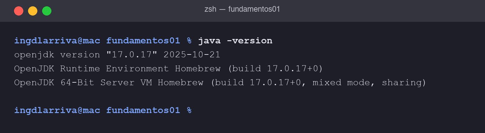
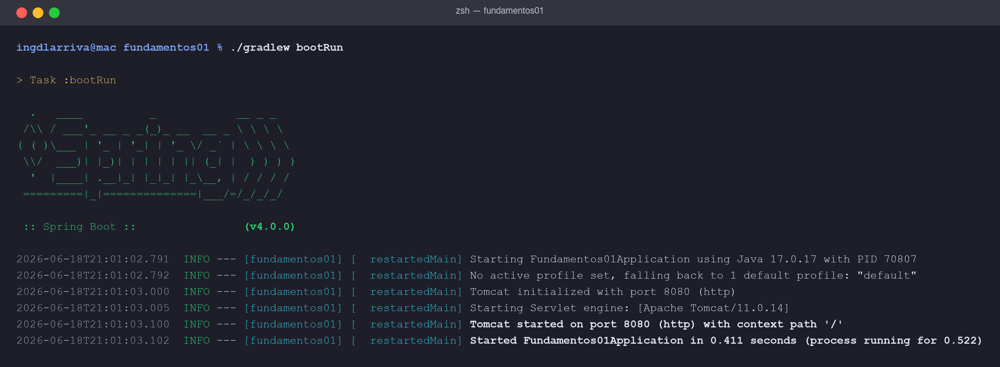
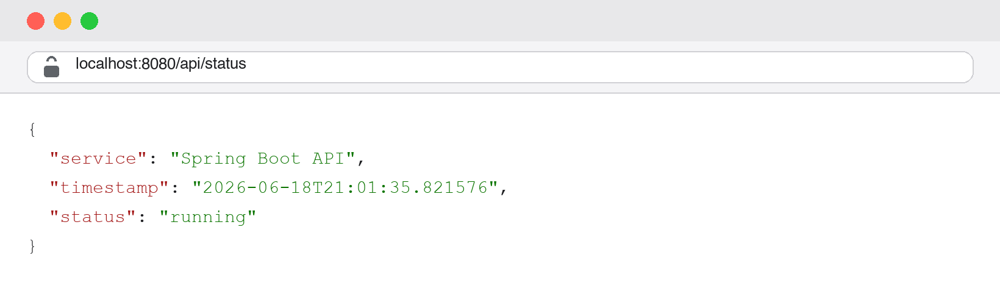
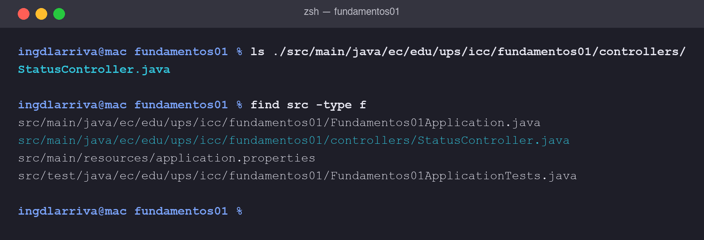

# Práctica 01 - Configuración de Spring Boot

Esta es la primera práctica de Spring Boot de la materia de Programación y Plataformas
Web. La idea es dejar el entorno listo, crear el proyecto y levantar un primer endpoint
que responda en `/api/status`.

## Datos del proyecto

- Group: `ec.edu.ups.icc`
- Artifact: `fundamentos01`
- Package: `ec.edu.ups.icc.fundamentos01`
- Java 17, Gradle (Groovy), Spring Boot 4.0.0
- Dependencias: Spring Web y Spring Boot DevTools

## Cómo correrlo

Desde la carpeta del proyecto:

```bash
./gradlew bootRun
```

Cuando arranca, el servidor (un Tomcat embebido) queda escuchando en el puerto 8080.
Para probar el endpoint abro en el navegador:

```
http://localhost:8080/api/status
```

Y la respuesta es algo así:

```json
{
  "service": "Spring Boot API",
  "status": "running",
  "timestamp": "2026-06-18T21:01:35.821576"
}
```

## El endpoint

El controlador está en
`src/main/java/ec/edu/ups/icc/fundamentos01/controllers/StatusController.java`:

```java
@RestController
public class StatusController {

    @GetMapping("/api/status")
    public Map<String, Object> status() {
        return Map.of(
                "service", "Spring Boot API",
                "status", "running",
                "timestamp", LocalDateTime.now().toString()
        );
    }
}
```

## Capturas

Verificación de Java 17:



Servidor levantado con `./gradlew bootRun`:



Respuesta del endpoint en el navegador:



Estructura del proyecto:



## Lo que entendí

El endpoint `/api/status` responde a una petición GET y devuelve un JSON con el estado
del servicio. Como la clase tiene `@RestController`, lo que retorna el método se
convierte solo a JSON, así que no hace falta una vista ni una plantilla.

De Spring Boot me llamó la atención que casi no hay que configurar nada: con la
dependencia de Spring Web ya queda armado todo lo necesario para una app web. La
anotación `@SpringBootApplication` es la que arranca el proyecto.

Lo otro importante es el servidor embebido: no tuve que instalar Tomcat aparte, ya viene
dentro del proyecto. Por eso con un solo comando se levanta todo y en los logs aparece
"Tomcat started on port 8080" y luego "Started Fundamentos01Application".
