# Prácticas Spring Boot - fundamentos01

Proyecto de la materia Programación y Plataformas Web (UPS).

## Datos del proyecto

- Group: `ec.edu.ups.icc`
- Artifact: `fundamentos01`
- Java 25
- Gradle (Groovy)
- Spring Boot 4.1.0
- Dependencias:
  - Spring Web
  - Spring Boot DevTools

## Ejecutar el proyecto

```bash
./gradlew bootRun
```

La aplicación inicia en el puerto **8080**.

En `application.yml` se configuró la ruta base `/api`.

---

# Práctica 01 - Configuración

## Objetivo

Configurar el proyecto y comprobar que spring funciona correctamente.

### Endpoint

```text
GET http://localhost:8080/api/api/status
```

Respuesta:

```json
{
  "service": "Spring Boot API",
  "status": "running",
  "timestamp": "2026-06-19T02:43:22.606358Z"
}
```

> La ruta queda como `/api/api/status` porque se usa `context-path: /api` y el controller también tiene `/api/status`.

---

# Práctica 02 - Estructura del proyecto

## Objetivo

Organizar el proyecto por paquetes y crear el módulo **students**.

### Endpoints

```text
GET /api/students
GET /api/students/count
```

Respuesta:

```json
[
  {
    "id": 2,
    "name": "Juan",
    "age": "30"
  },
  {
    "id": 1,
    "name": "Diego",
    "age": "10"
  }
]
```

---

# Práctica 03 - API REST

## Objetivo

Crear un CRUD para **users** y **products** usando dto, model y mapper. En esta práctica los datos todavía se guardan en memoria.

## Endpoints

### Users

| Método | Ruta |
|---------|------|
| GET | `/api/users` |
| GET | `/api/users/{id}` |
| POST | `/api/users` |
| PUT | `/api/users/{id}` |
| PATCH | `/api/users/{id}` |
| DELETE | `/api/users/{id}` |

Para **products** son los mismos endpoints cambiando `/users` por `/products`.

## Crear usuario

```http
POST /api/users
```

```json
{
  "name": "Ana",
  "email": "ana@ups.edu.ec",
  "password": "1234"
}
```

Respuesta:

```json
{
  "id": 1,
  "name": "Ana",
  "email": "ana@ups.edu.ec"
}
```

Si el usuario no existe:

```json
{
  "message": "Usuario no encontrado con id 99"
}
```

Ejemplo de producto:

```json
{
  "id": 1,
  "name": "Teclado",
  "price": 25.5,
  "stock": 10
}
```

## Estructura

```text
users/
├── controllers/UserController.java
├── dtos/
├── models/UserModel.java
└── mappers/UserMapper.java
```

`products` tiene la misma estructura.

---

# Práctica 04 - Controladores y servicios

## Objetivo

Separar la lógica del controller y moverla a la capa de servicios.

Ahora el controller solo recibe la petición y llama al servicio.

## Ejemplo

```java
@RestController
@RequestMapping("/users")
public class UserController {

    private final UserService userService;

    public UserController(UserService userService) {
        this.userService = userService;
    }

    @GetMapping
    public List<UserResponseDto> findAll() {
        return userService.findAll();
    }
}
```

## Nueva estructura

```text
users/
├── controllers/
├── services/
│   ├── UserService.java
│   └── UserServiceImpl.java
├── dtos/
├── models/
└── mappers/
```

`products` utiliza la misma estructura.

Los endpoints siguen siendo los mismos de la práctica anterior.

# Práctica 05 - Persistencia con PostgreSQL y JPA

## Objetivo

Guardar la información en **postgresql** usando **spring data jpa**.

## Configuración

- Se creó un contenedor de docker con PostgreSQL.
- Se configuró la conexión en `application.yml`.
- Se agregaron las dependencias de JPA y PostgreSQL.

## Archivos nuevos

```text
core/
└── entities/BaseEntity.java

users/
├── entities/UserEntity.java
└── repositories/UserRepository.java
```

El `UserMapper` también convierte entre **Model** y **Entity**.

## Cambios en el servicio

Ahora el servicio usa `UserRepository` en lugar de una lista en memoria.

```java
private final UserRepository userRepository;

public UserServiceImpl(UserRepository userRepository) {
    this.userRepository = userRepository;
}
```

Los métodos utilizan `save()`, `findById()` y `findAll()`.

El borrado es lógico usando el campo `deleted`.

## Verificación

```bash
docker exec -it postgres-dev psql -U ups -d devdb -c "SELECT * FROM users;"
```

---

# Práctica 06 - Validación de DTOs

## Objetivo

Validar los datos antes de guardarlos.

## Dependencia

Se agregó:

```text
spring-boot-starter-validation
```

## Validaciones

Ejemplo en los dto:

```java
@NotBlank(message = "El nombre es obligatorio")
@Size(min = 3, max = 150)
private String name;

@NotBlank(message = "El email es obligatorio")
@Email(message = "Debe ingresar un email válido")
private String email;
```

Para productos también se agregaron validaciones como:

```java
@Min(0)
private Double price;

@Min(0)
private Integer stock;
```

## Activar la validación

```java
@PostMapping
public UserResponseDto create(@Valid @RequestBody CreateUserDto dto) {
    return userService.create(dto);
}
```

## Validaciones en el servicio

También se valida que el correo no exista.

```java
if (userRepository.findByEmail(dto.getEmail()).isPresent()) {
    throw new ConflictException("Email already registered");
}
```

En products también se valida que no exista otro producto con el mismo nombre.

---

# Práctica 07 - Manejo global de errores

## Objetivo

Responder errores con un formato único.

## Estructura

```text
core/exceptions/
├── base/ApplicationException.java
├── domain/
│   ├── NotFoundException.java
│   ├── ConflictException.java
│   └── BadRequestException.java
├── response/ErrorResponse.java
└── handler/GlobalExceptionHandler.java
```

## Handler

```java
@ExceptionHandler(ApplicationException.class)
public ResponseEntity<ErrorResponse> handleApplicationException(
        ApplicationException ex,
        HttpServletRequest request) {

    return ResponseEntity.status(ex.getStatus())
            .body(new ErrorResponse(
                    ex.getStatus(),
                    ex.getMessage(),
                    request.getRequestURI()));
}
```

También se agregó manejo para:

- `MethodArgumentNotValidException`
- `Exception`

## Cambios

En los servicios se reemplazó:

```java
throw new IllegalStateException(...)
```

por

```java
.orElseThrow(() -> new NotFoundException("User not found"));
```

Los registros con `deleted = true` ya no se muestran.

## Pruebas

```bash
# Error de validación
curl -X POST localhost:8080/api/products \
-H "Content-Type: application/json" \
-d '{"name":"","price":-5,"stock":-1}'
```

```bash
# Producto repetido
curl -X POST localhost:8080/api/products \
-H "Content-Type: application/json" \
-d '{"name":"laptop","price":800,"stock":5}'
```

```bash
# Producto no encontrado
curl localhost:8080/api/products/999
```

---

# Práctica 08 - Relaciones entre entidades

## Objetivo

Relacionar **products**, **users** y **categories**.

## Nuevo módulo

```text
categories/
├── controllers/
├── dtos/
├── entities/
├── models/
├── mappers/
├── repositories/
└── services/
```

### Endpoints

```text
GET    /api/categories
GET    /api/categories/{id}
POST   /api/categories
PUT    /api/categories/{id}
DELETE /api/categories/{id}
```

## Relaciones

```java
@ManyToOne(optional = false, fetch = FetchType.LAZY)
@JoinColumn(name = "user_id")
private UserEntity owner;

@ManyToOne(optional = false, fetch = FetchType.LAZY)
@JoinColumn(name = "category_id")
private CategoryEntity category;
```

## DTO

Ahora el producto recibe los ids de usuario y categoría.

```text
userId
categoryId
```

La respuesta devuelve la información relacionada.

```json
{
  "id": 9,
  "name": "Laptop Gaming 08",
  "price": 1200,
  "stock": 10,
  "owner": {
    "id": 7,
    "name": "Juan Perez"
  },
  "category": {
    "id": 1,
    "name": "Electronicos"
  }
}
```

## Validación

Antes de guardar un producto se verifica que el usuario y la categoría existan.

```java
UserEntity owner = userRepository.findById(dto.getUserId())
        .orElseThrow(() -> new NotFoundException("User not found"));

CategoryEntity category = categoryRepository.findById(dto.getCategoryId())
        .orElseThrow(() -> new NotFoundException("Category not found"));
```

## Consultas

Se agregaron estos métodos al repositorio.

```java
List<ProductEntity> findByOwner_IdAndDeletedFalse(Long ownerId);

List<ProductEntity> findByCategory_IdAndDeletedFalse(Long categoryId);
```

También se agregaron dos endpoints.

```text
GET /api/products/user/{userId}

GET /api/products/category/{categoryId}
```

## Verificación

```bash
docker exec -it postgres-dev psql -U ups -d devdb -c "\d products"
```

```sql
SELECT p.id,
       p.name,
       p.user_id,
       u.name,
       p.category_id,
       c.name
FROM products p
INNER JOIN users u ON p.user_id = u.id
INNER JOIN categories c ON p.category_id = c.id;
```
# Práctica 09 - Filtros con query params

## Objetivo

Agregar filtros para consultar los productos de un usuario.

## Endpoint

```text
GET /api/users/1/products
GET /api/users/1/products?name=laptop
GET /api/users/1/products?minPrice=400&maxPrice=700
```

Los filtros son opcionales.

## Controller

```java
@GetMapping("/{id}/products")
public List<ProductResponseDto> findProductsByUser(
        @PathVariable Long id,
        @Valid @ModelAttribute ProductFilterDto filters
) {
    return userService.findProductsByUser(id, filters);
}
```

## Consulta

```java
@Query("""
SELECT p FROM ProductEntity p
WHERE p.deleted = false
AND p.owner.id = :userId
AND (COALESCE(:name,'') = '' OR LOWER(p.name)
LIKE LOWER(CONCAT('%',COALESCE(:name,''),'%')))
AND (:minPrice IS NULL OR p.price >= :minPrice)
AND (:maxPrice IS NULL OR p.price <= :maxPrice)
""")
```

---

# Práctica 10 - Paginación

## Objetivo

Agregar paginación usando **Page** y **Slice**.

## Endpoints

```text
GET /api/products/page
GET /api/products/slice
```

Parámetros disponibles:

| Parámetro | Valor por defecto |
|-----------|-------------------|
| page | 0 |
| size | 10 |
| sortBy | id |
| direction | asc |

Ejemplos:

```text
GET /api/products/page?page=0&size=5&sortBy=price&direction=desc

GET /api/products/slice?page=0&size=5&sortBy=createdAt&direction=desc
```

## DTO

Se creó:

```text
core/dtos/PaginationDto.java
```

## Repository

```java
@Query(
value = "SELECT p FROM ProductEntity p WHERE p.deleted = false",
countQuery = "SELECT COUNT(p) FROM ProductEntity p WHERE p.deleted = false"
)
Page<ProductEntity> findActivePage(Pageable pageable);

@Query("SELECT p FROM ProductEntity p WHERE p.deleted = false")
Slice<ProductEntity> findActiveSlice(Pageable pageable);
```

## Datos de prueba

```bash
docker exec -i postgres-dev psql -U ups -d devdb < seed_data.sql
```

## Resultado con Page

```json
{
  "number": 0,
  "size": 3,
  "totalElements": 20300,
  "totalPages": 6767,
  "first": true,
  "last": false
}
```


## Resultado con Slice

```json
{
  "number": 0,
  "size": 3,
  "first": true,
  "last": false
}
```


## Error de validación

```json
{
  "status": 400,
  "error": "Bad Request",
  "message": "Datos de entrada inválidos",
  "details": {
    "page": "La página debe ser mayor o igual a 0",
    "size": "El tamaño debe ser mayor o igual a 1"
  }
}
```


## Categorías paginadas

Se agregaron estos endpoints.

```text
GET /api/categories/{id}/products

GET /api/categories/{id}/products/page

GET /api/categories/{id}/products/slice
```

Ejemplo:

```text
GET /api/categories/1/products/page?name=seed&page=0&size=5&sortBy=price&direction=desc
```


---

# Práctica 11 - Autenticación con JWT

## Objetivo

Agregar autenticación usando JWT.

## Endpoints

```text
POST /api/auth/register

POST /api/auth/login
```

Después del login se debe enviar el token.

```text
Authorization: Bearer <token>
```

## Archivos

- JwtUtil
- JwtAuthenticationFilter
- JwtAuthenticationEntryPoint
- AuthService

## Registro

```http
POST /api/auth/register
```

```json
{
  "name": "Ana Torres",
  "email": "ana@example.com",
  "password": "Secret123"
}
```


## Login


## Sin token

```json
{
  "status": 401,
  "message": "Token de autenticación inválido o no proporcionado"
}
```


## Con token


---

# Práctica 12 - Roles y @PreAuthorize

## Objetivo

Restringir algunos endpoints según el rol del usuario.

## Ejemplo

```java
@GetMapping
@PreAuthorize("hasRole('ADMIN')")
public List<ProductResponseDto> findAll() {
    return productService.findAll();
}
```

También se aplicó en `UserController`.

## Manejo del 403

Se agregaron estos handlers.

```java
@ExceptionHandler(AuthorizationDeniedException.class)

@ExceptionHandler(AccessDeniedException.class)
```

## Asignar rol ADMIN

```sql
INSERT INTO user_roles (user_id, role_id)
SELECT u.id, r.id
FROM users u, roles r
WHERE u.email = 'admin@example.com'
AND r.name = 'ROLE_ADMIN';
```

Después es necesario volver a iniciar sesión para generar un nuevo token.

## Usuario sin permisos

```json
{
  "status": 403,
  "message": "No tienes permisos para acceder a este recurso"
}
```


## Usuario ADMIN


---

# Práctica 13 - Ownership y validación de propiedad

## Objetivo

Que un usuario solo pueda editar o eliminar sus propios productos. Un ADMIN puede modificar cualquiera.

## CreateProductDto

Ya no recibe `userId`. El owner sale del token, no del body.

## ProductService

Los métodos que modifican datos ahora reciben al usuario autenticado.

```java
ProductResponseDto create(CreateProductDto dto, UserDetailsImpl currentUser);
ProductResponseDto update(Long id, UpdateProductDto dto, UserDetailsImpl currentUser);
void delete(Long id, UserDetailsImpl currentUser);
```

## validateOwnership

```java
private void validateOwnership(ProductEntity product, UserDetailsImpl currentUser) {
    if (hasRole(currentUser, "ROLE_ADMIN")) {
        return;
    }

    if (!product.getOwner().getId().equals(currentUser.getId())) {
        throw new AccessDeniedException("No puedes modificar productos ajenos");
    }
}
```

Se llama antes de `update`, `partialUpdate` y `delete` en `ProductServiceImpl`.

## GlobalExceptionHandler

El handler de `AccessDeniedException` ahora usa el mensaje de la excepción en vez de uno fijo.

```java
@ExceptionHandler(AccessDeniedException.class)
public ResponseEntity<ErrorResponse> handleAccessDeniedException(
        AccessDeniedException ex,
        HttpServletRequest request) {

    String message = ex.getMessage() != null ? ex.getMessage() : "Acceso denegado";

    return ResponseEntity.status(HttpStatus.FORBIDDEN)
            .body(new ErrorResponse(HttpStatus.FORBIDDEN, message, request.getRequestURI()));
}
```

## Slice solo del dueño

`GET /products/slice` sigue abierto a cualquier usuario logueado, pero ahora filtra por owner en el repositorio, no en Java: así la base de datos devuelve únicamente las filas de ese usuario en vez de traer todos los productos a memoria.

```java
@Query("""
        SELECT p
        FROM ProductEntity p
        WHERE p.deleted = false
          AND p.owner.id = :userId
        """)
Slice<ProductEntity> findActiveSliceByOwnerId(@Param("userId") Long userId, Pageable pageable);
```

## Crear producto sin userId

```http
POST /api/products
```

```json
{
  "name": "Laptop",
  "price": 900,
  "stock": 10,
  "categoryIds": [1]
}
```

El `owner` de la respuesta corresponde al usuario del token, no a nada enviado en el body.

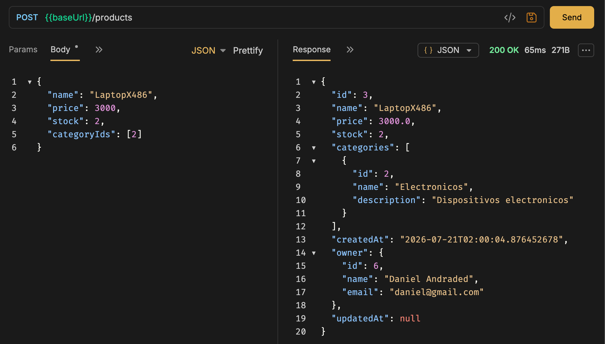

## Editar producto propio

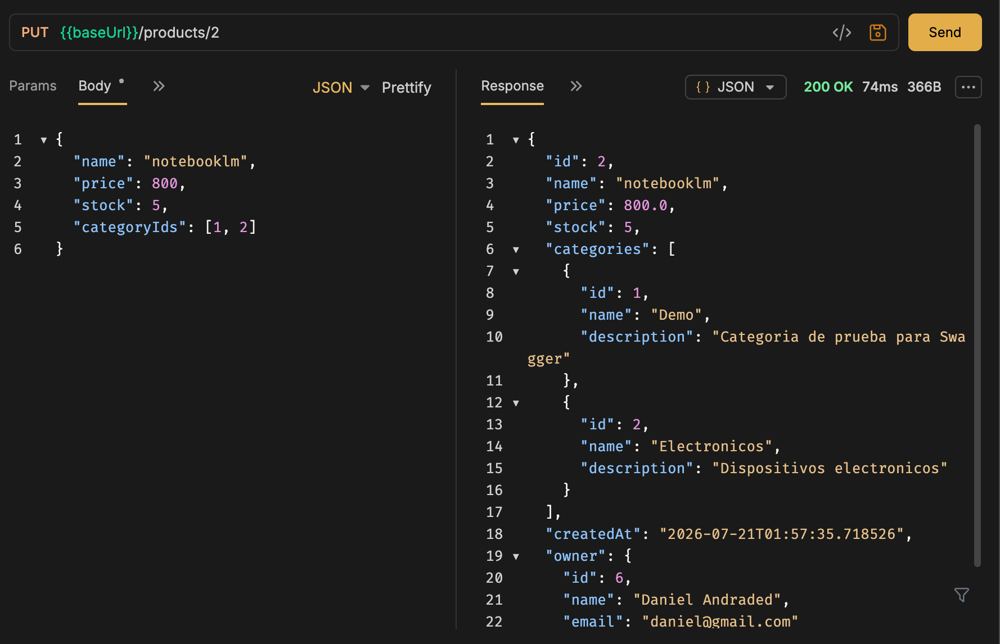

## Editar producto ajeno

```json
{
  "status": 403,
  "message": "No puedes modificar productos ajenos"
}
```

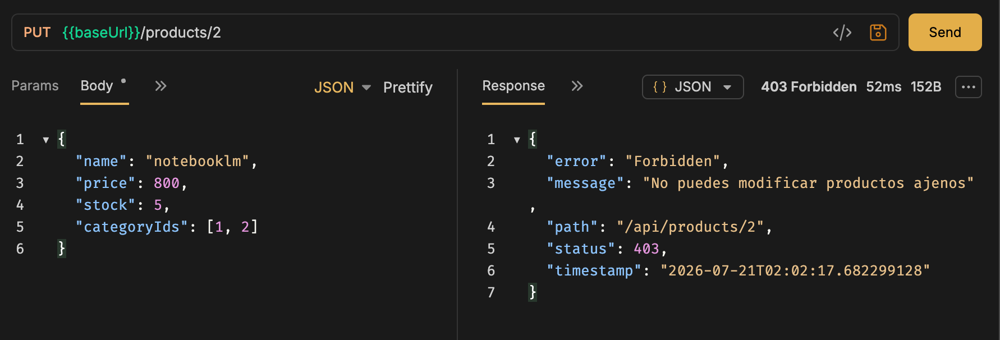

## Eliminar producto ajeno

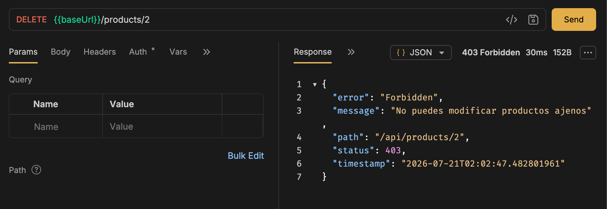


## Slice solo del dueño

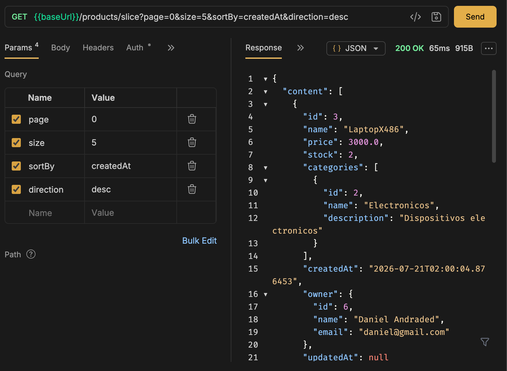

---

# Práctica 14 - Despliegue en producción

## Objetivo

Preparar el proyecto para correr en un ambiente real: profiles separados por ambiente, Actuator para monitoreo, y una imagen Docker pensada para producción (no solo para desarrollo).

## Profiles

```
src/main/resources/
├── application.yml        ← Base (común a dev y prod)
├── application-dev.yml    ← Desarrollo
└── application-prod.yml   ← Producción
```

`application-prod.yml` no tiene ningún valor hardcodeado, todo sale de variables de entorno:

```yaml
spring:
  datasource:
    url: ${DATABASE_URL}
    username: ${DB_USERNAME}
    password: ${DB_PASSWORD}
  jpa:
    hibernate:
      ddl-auto: validate

jwt:
  secret: ${JWT_SECRET}
```

`ddl-auto: validate` en vez de `update`: en producción Hibernate solo verifica que las tablas coincidan con las entidades, nunca las modifica solo.

Por defecto corre con `dev` (definido en `application.yml`). Para activar otro:

```bash
./gradlew bootRun --args='--spring.profiles.active=prod'
```

## Spring Boot Actuator

```
implementation 'org.springframework.boot:spring-boot-starter-actuator'
```

```yaml
management:
  endpoints:
    web:
      exposure:
        include: health,info,metrics
```

## Proteger Actuator

```java
.requestMatchers("/actuator/health").permitAll()
.requestMatchers("/actuator/**").hasRole("ADMIN")
```

Bug que encontré al probar esto: cuando `hasRole` deniega el acceso, Spring hace un forward interno a `/error` para armar la respuesta, y mi filtro JWT no persiste el contexto de login en un `SecurityContextRepository`, así que ese forward perdía la sesión y devolvía 401 en vez de 403. Se arregla dejando `/error` público (la decisión de seguridad real ya se tomó antes):

```java
.requestMatchers("/error").permitAll()
```

## Dockerfile de producción

Cambios sobre el Dockerfile de la práctica de Docker:

```dockerfile
RUN addgroup -S spring && adduser -S spring -G spring
USER spring:spring

HEALTHCHECK --interval=30s --timeout=3s --start-period=60s --retries=3 \
  CMD wget --no-verbose --tries=1 --spider http://localhost:8080/api/actuator/health || exit 1

ENV SPRING_PROFILES_ACTIVE=prod

ENTRYPOINT ["java", "-Djava.security.egd=file:/dev/./urandom", "-Xms256m", "-Xmx512m", "-jar", "app.jar"]
```

- Usuario no-root: si alguien ejecuta código dentro del contenedor, no corre como root.
- `HEALTHCHECK`: es lo que hace que `docker ps` muestre `(healthy)` en vez de solo `Up`.

## docker-compose con profile prod

```yaml
environment:
  SPRING_PROFILES_ACTIVE: prod
  DATABASE_URL: jdbc:postgresql://db:5432/devdb
  DB_USERNAME: ups
  DB_PASSWORD: ups123
  JWT_SECRET: ...
```

## Probando

```bash
docker compose up -d --build
docker ps
```

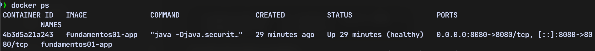

Health check público, sin token:

```bash
curl http://localhost:8080/api/actuator/health
```

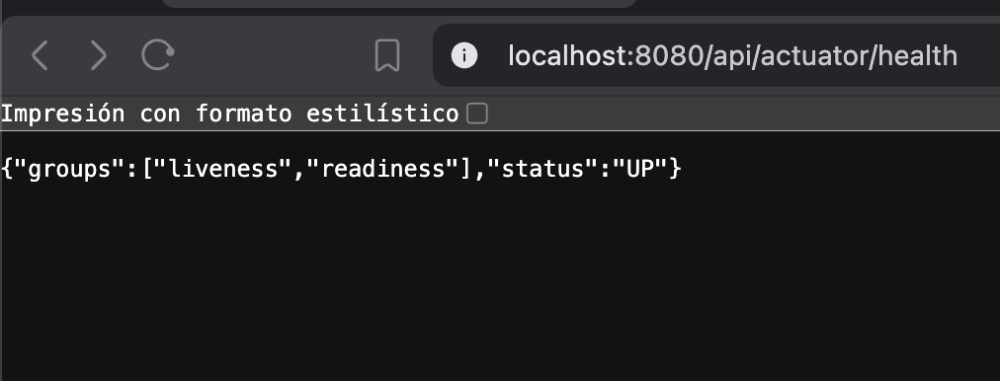

Metrics con un usuario normal (no ADMIN):

```json
{
  "status": 403,
  "error": "Forbidden",
  "path": "/api/actuator/metrics"
}
```

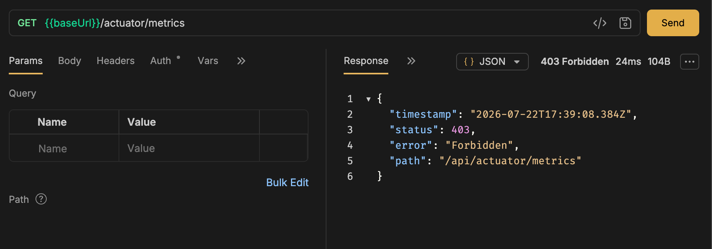

Metrics con ADMIN:

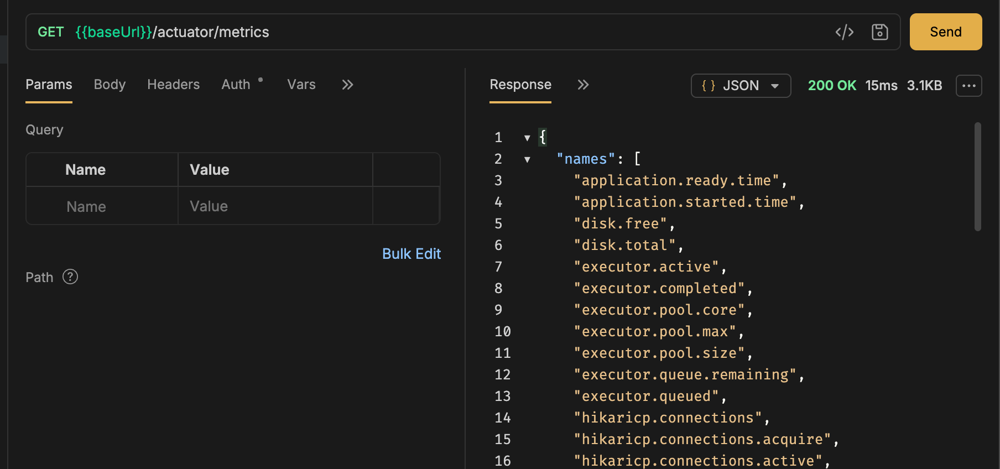

---

# Práctica 15 - Documentación con Swagger/OpenAPI

## Objetivo

Que la API se documente sola a partir del código: cada endpoint y cada DTO explicado, probable desde el navegador, sin depender de Bruno/Postman para saber qué manda o devuelve cada ruta.

## Dependencia

```groovy
implementation 'org.springdoc:springdoc-openapi-starter-webmvc-ui:2.8.9'
```

## OpenApiConfig

Registra el título/descripción de la API y el esquema `bearerAuth`, para que Swagger UI muestre el botón **Authorize** y mande el JWT en cada request de prueba:

```java
@Bean
public OpenAPI customOpenAPI() {
    SecurityScheme bearerScheme = new SecurityScheme()
            .type(SecurityScheme.Type.HTTP)
            .scheme("bearer")
            .bearerFormat("JWT");

    return new OpenAPI()
            .info(new Info().title("API de programacion y plataformas web").version("1.0.0"))
            .components(new Components().addSecuritySchemes("bearerAuth", bearerScheme))
            .addSecurityItem(new SecurityRequirement().addList("bearerAuth"));
}
```

## Abrir Swagger sin token

`SecurityConfig` ya exige token en casi todo, así que Swagger también quedaba bloqueado. Se agregó:

```java
.requestMatchers("/v3/api-docs/**", "/swagger-ui/**", "/swagger-ui.html").permitAll()
```

## Documentar endpoints

En los controllers, `@Operation` para el resumen y `@ApiResponses` para los códigos posibles:

```java
@Operation(summary = "iniciar sesión")
@ApiResponses({
        @ApiResponse(responseCode = "200", description = "login correcto, devuelve access token y refresh token"),
        @ApiResponse(responseCode = "401", description = "email o contraseña incorrectos")
})
@PostMapping("/login")
```

Se documentaron así los 4 endpoints de `AuthController` y los 10 de `ProductController`.

## Documentar DTOs

`@Schema` en la clase y en cada campo:

```java
@Schema(description = "Datos requeridos para iniciar sesión")
public class LoginRequestDto {

    @Schema(description = "Correo institucional o personal del usuario", example = "usera@ups.edu.ec")
    private String email;
}
```

Se aplicó a `LoginRequestDto`, `RegisterRequestDto`, `PaginationDto`, `CreateProductDto`, `UpdateProductDto`, `PartialUpdateProductDto` y `ProductResponseDto`.

## ¿Por qué Swagger puede quedar público si los endpoints siguen protegidos?

Porque son dos cosas distintas: `/swagger-ui/**` y `/v3/api-docs/**` solo devuelven la *descripción* de la API (qué endpoints existen, qué reciben, qué responden). No exponen datos reales ni saltan la seguridad — para efectivamente llamar a un endpoint protegido desde Swagger, igual hay que loguearse y usar el botón Authorize con un JWT válido, igual que con cualquier otro cliente HTTP.

## Probando

Swagger UI cargado, con los controllers agrupados por tag:

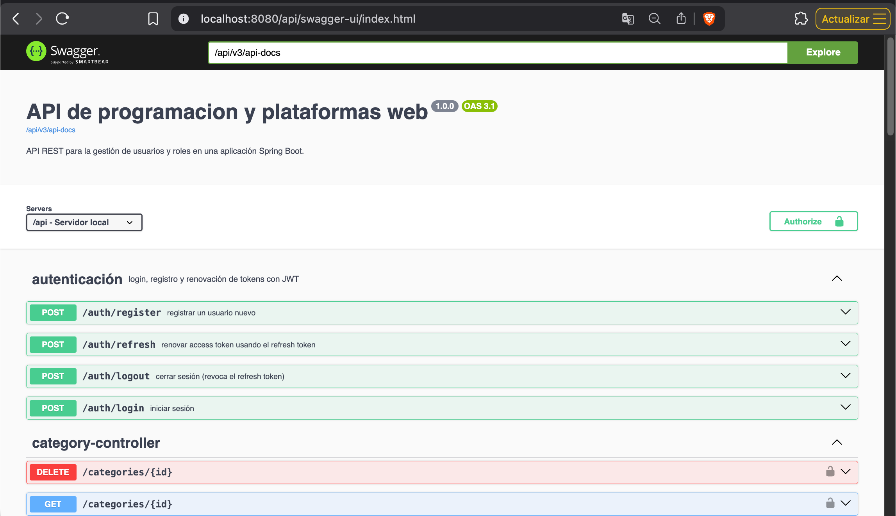

JSON de OpenAPI (`/api/v3/api-docs`):

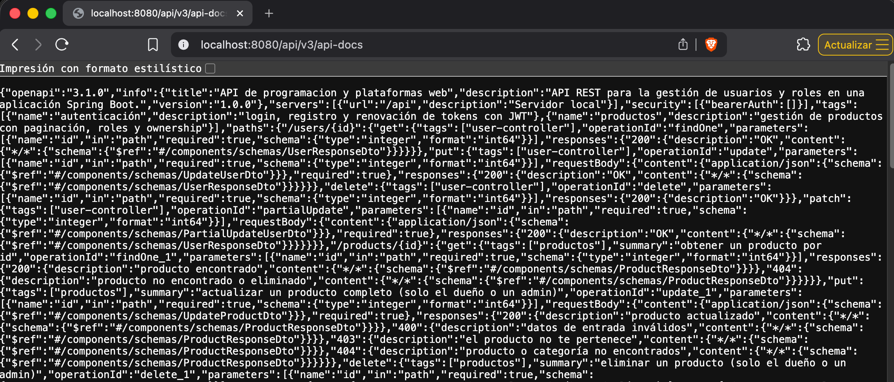

AuthController documentado:

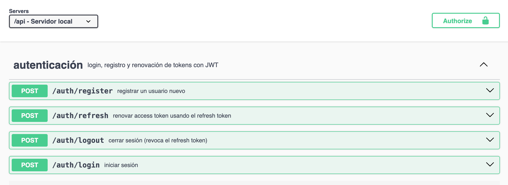

Botón Authorize con el esquema bearerAuth:

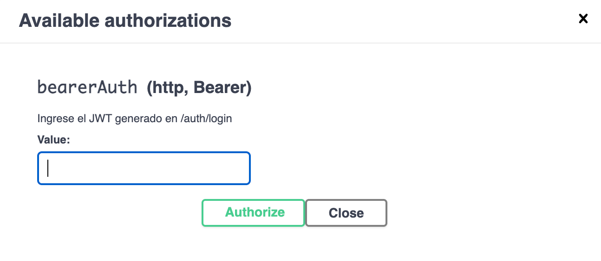

Endpoint protegido sin token (401):

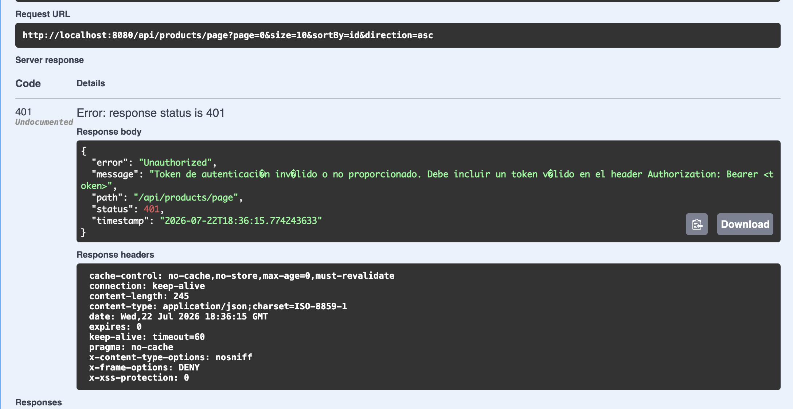

Mismo endpoint autorizado desde Swagger (200):

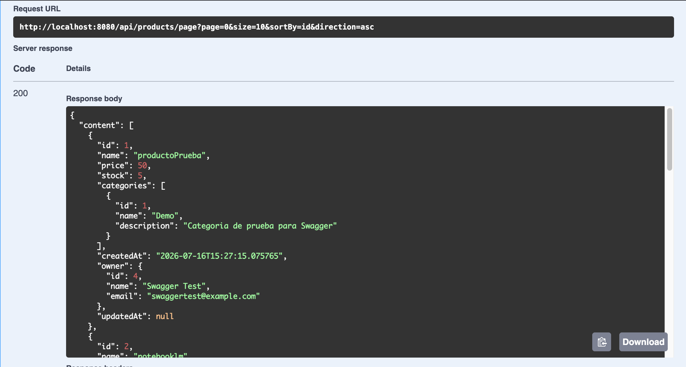

Endpoint solo-ADMIN con usuario normal (403):

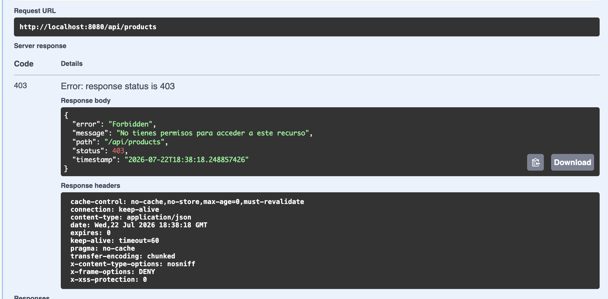

Mismo endpoint con usuario ADMIN (200):

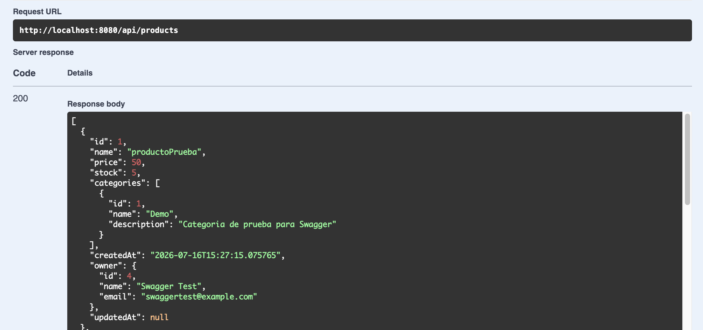


